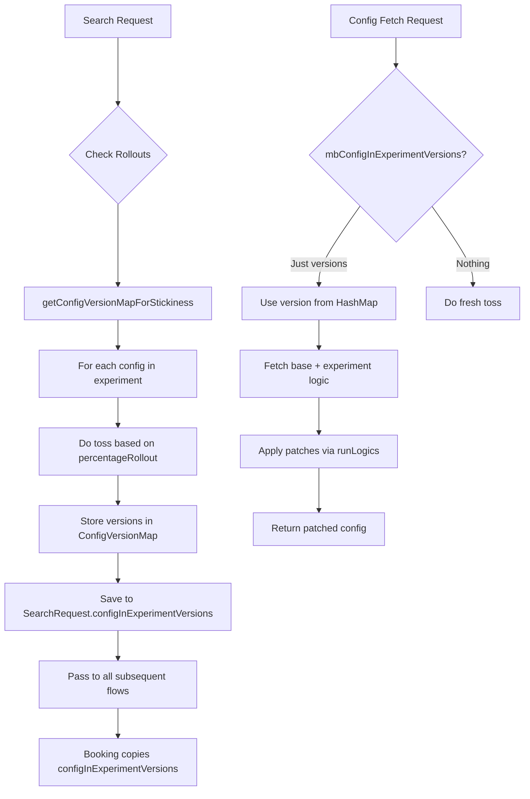

# Config Management Dashboard - Complete Implementation Plan

End-to-end plan for building a self-serve Config Management Dashboard enabling direct config editing, controlled rollouts, experiment management, and performance monitoring.

---

## 1. Config Resolution Flow (Already Implemented ✓)

The existing infrastructure in [DynamicLogic.hs](file:///Users/addhithyarh/Documents/nammayatri/Backend/lib/utils/src/Tools/DynamicLogic.hs) already implements the core resolution flow:

### How Config Resolution Works



### Key Functions (Already Exist)

| Function | Location | Purpose |
|----------|----------|---------|
| `getConfigVersionMapForStickiness` | [DynamicLogic.hs:222](file:///Users/addhithyarh/Documents/nammayatri/Backend/lib/utils/src/Tools/DynamicLogic.hs#L222-L238) | Toss for all configs at search, creates version map |
| `findOneConfig` / `findAllConfigs` | [DynamicLogic.hs:25](file:///Users/addhithyarh/Documents/nammayatri/Backend/lib/utils/src/Tools/DynamicLogic.hs#L25-L58) | Fetch and apply patches to configs |
| `selectVersionForUnboundedConfigs` | [DynamicLogic.hs:161](file:///Users/addhithyarh/Documents/nammayatri/Backend/lib/utils/src/Tools/DynamicLogic.hs#L161-L172) | Random toss based on rollout percentages |
| `processConfig` | [DynamicLogic.hs:94](file:///Users/addhithyarh/Documents/nammayatri/Backend/lib/utils/src/Tools/DynamicLogic.hs#L94-L108) | Apply JSONLogic patches |
| `chooseLogic` | [DynamicLogic.hs:209](file:///Users/addhithyarh/Documents/nammayatri/Backend/lib/utils/src/Tools/DynamicLogic.hs#L209-L220) | Weighted random selection |

### Stickiness Implementation

- **SearchRequest**: `configInExperimentVersions :: [ConfigVersionMap]` - [SearchRequest.hs:31](file:///Users/addhithyarh/Documents/nammayatri/Backend/app/provider-platform/dynamic-offer-driver-app/Main/src-read-only/Domain/Types/SearchRequest.hs#L31)
- **Booking**: `configInExperimentVersions :: [ConfigVersionMap]` - [Booking.hs:39](file:///Users/addhithyarh/Documents/nammayatri/Backend/app/provider-platform/dynamic-offer-driver-app/Main/src-read-only/Domain/Types/Booking.hs#L39)

---

## 2. What Needs to Be Built

### 2.1 Backend: Direct Config Editing (NEW)

Currently, config changes require:
1. Create JSONLogic patch via `/appDynamicLogic/verify`
2. Set rollout via `/appDynamicLogic/upsertLogicRollout`

**Gap**: No way to directly edit config values with type validation.

#### [MODIFY] [NammaTag.yaml](file:///Users/addhithyarh/Documents/nammayatri/Backend/app/dashboard/CommonAPIs/spec/ProviderPlatform/Management/API/NammaTag.yaml)

```yaml
# Direct config editing with validation
- POST:
    endpoint: /configPilot/updateConfig
    auth: ApiAuthV2
    request:
      type: UpdateConfigReq
    response:
      type: UpdateConfigResp

# Get config schema for type validation
- GET:
    endpoint: /configPilot/configSchema
    auth: ApiAuthV2
    mandatoryQuery:
      tableName: ConfigType
    response:
      type: ConfigSchemaResp

# Preview patched config before creating experiment
- POST:
    endpoint: /configPilot/previewPatch
    auth: ApiAuthV2
    request:
      type: PreviewPatchReq
    response:
      type: PreviewPatchResp
```

#### [MODIFY] [Types.hs](file:///Users/addhithyarh/Documents/nammayatri/Backend/lib/yudhishthira/src/Lib/Yudhishthira/Types.hs)

```haskell
-- Request to update config with validation
data UpdateConfigReq = UpdateConfigReq
  { domain :: LogicDomain,
    configChanges :: Value,  -- Partial config changes
    description :: Maybe Text,
    shouldCreateExperiment :: Bool,
    initialRolloutPercentage :: Maybe Int
  }

-- Response with validation result
data UpdateConfigResp = UpdateConfigResp
  { version :: Maybe Int,
    validationErrors :: [Text],
    patchedElement :: Maybe Value
  }

-- Config schema for UI field validation
data ConfigSchemaResp = ConfigSchemaResp
  { fields :: [ConfigFieldSchema]
  }

data ConfigFieldSchema = ConfigFieldSchema
  { fieldName :: Text,
    fieldType :: Text,  -- "Int", "Bool", "Text", "[Text]", etc.
    required :: Bool,
    defaultValue :: Maybe Value
  }

-- Preview patch result
data PreviewPatchReq = PreviewPatchReq
  { domain :: LogicDomain,
    configChanges :: Value,
    baseVersion :: Maybe Int
  }

data PreviewPatchResp = PreviewPatchResp
  { originalConfig :: Value,
    patchedConfig :: Value,
    diffHighlights :: Value
  }
```

---

### 2.2 Backend: Experiment Metrics & Monitoring (NEW)

#### [MODIFY] [NammaTag.yaml](file:///Users/addhithyarh/Documents/nammayatri/Backend/app/dashboard/CommonAPIs/spec/ProviderPlatform/Management/API/NammaTag.yaml)

```yaml
# Get booking conversion metrics per version
- GET:
    endpoint: /configPilot/experimentMetrics
    auth: ApiAuthV2
    mandatoryQuery:
      domain: LogicDomain
      version: Int
    query:
      fromDate: UTCTime
      toDate: UTCTime
    response:
      type: ExperimentMetricsResp

# Get experiment history with status transitions
- GET:
    endpoint: /configPilot/experimentHistory
    auth: ApiAuthV2
    mandatoryQuery:
      domain: LogicDomain
    query:
      limit: Int
      offset: Int
    response:
      type: "[ExperimentHistoryResp]"

# Get all running experiments across all domains
- GET:
    endpoint: /configPilot/runningExperiments
    auth: ApiAuthV2
    response:
      type: "[RunningExperimentResp]"
```

#### [MODIFY] [Types.hs](file:///Users/addhithyarh/Documents/nammayatri/Backend/lib/yudhishthira/src/Lib/Yudhishthira/Types.hs)

```haskell
-- Experiment metrics from ClickHouse
data ExperimentMetricsResp = ExperimentMetricsResp
  { domain :: LogicDomain,
    version :: Int,
    totalSearches :: Int,
    totalBookings :: Int,
    conversionRate :: Double,
    timeRange :: (UTCTime, UTCTime)
  }

-- Experiment history entry
data ExperimentHistoryResp = ExperimentHistoryResp
  { version :: Int,
    status :: Maybe ExperimentStatus,
    percentageRollout :: Int,
    statusChangedAt :: Maybe UTCTime,
    modifiedBy :: Maybe (Id Person),
    description :: Maybe Text
  }

-- Running experiment summary
data RunningExperimentResp = RunningExperimentResp
  { domain :: LogicDomain,
    version :: Int,
    percentageRollout :: Int,
    baseVersion :: Int,
    createdAt :: UTCTime
  }
```

---

### 2.3 Database Schema Changes

#### [MODIFY] [AppDynamicLogic.yaml](file:///Users/addhithyarh/Documents/nammayatri/Backend/lib/yudhishthira/spec/Storage/AppDynamicLogic.yaml)

```diff
AppDynamicLogicRollout:
  fields:
    # ... existing fields ...
+   statusChangedAt: Maybe UTCTime
+   concludedFromVersion: Maybe Int
```

#### [NEW] Migration File

```sql
-- Add audit columns for experiment tracking
ALTER TABLE atlas_driver_offer_bpp.app_dynamic_logic_rollout 
  ADD COLUMN status_changed_at timestamp with time zone;

ALTER TABLE atlas_driver_offer_bpp.app_dynamic_logic_rollout 
  ADD COLUMN concluded_from_version integer;
```

---

### 2.4 Frontend Dashboard Components

#### Dashboard Page Structure

```
/config-management
├── /                    # Overview with active experiments
├── /configs             # All 27 config types list
├── /configs/:type       # Single config management
│   ├── Editor           # JSON editor with schema validation
│   ├── Experiments      # Version list with status
│   └── History          # Audit trail
├── /experiments         # All running experiments
└── /metrics             # Conversion tracking
```

#### Key Components to Build

| Component | Purpose | API Used |
|-----------|---------|----------|
| **ConfigListView** | Grid of all config types with experiment badges | `GET /configPilot/allConfigs` |
| **ConfigEditor** | Form-based config editing with type validation | `GET /configPilot/getTableData`, `POST /configPilot/updateConfig` |
| **ExperimentVersionList** | Shows all versions with status, rollout % | `GET /configPilot/configDetails` |
| **RolloutSlider** | Drag control to adjust rollout percentage | `POST /appDynamicLogic/upsertLogicRollout` |
| **ExperimentActions** | Conclude/Abort/Revert buttons | `POST /configPilot/actionChange` |
| **DiffViewer** | Side-by-side base vs patched config | `POST /configPilot/previewPatch` |
| **MetricsPanel** | Booking conversion charts | `GET /configPilot/experimentMetrics` |

---

## 3. Implementation Files Summary

### Backend (New/Modified)

| File | Action | Description |
|------|--------|-------------|
| [NammaTag.yaml](file:///Users/addhithyarh/Documents/nammayatri/Backend/app/dashboard/CommonAPIs/spec/ProviderPlatform/Management/API/NammaTag.yaml) | MODIFY | Add 6 new endpoints |
| [Types.hs](file:///Users/addhithyarh/Documents/nammayatri/Backend/lib/yudhishthira/src/Lib/Yudhishthira/Types.hs) | MODIFY | Add 10 new types |
| [Dashboard.hs](file:///Users/addhithyarh/Documents/nammayatri/Backend/lib/yudhishthira/src/Lib/Yudhishthira/Flow/Dashboard.hs) | MODIFY | Add new handler functions |
| [NammaTag.hs (Provider)](file:///Users/addhithyarh/Documents/nammayatri/Backend/app/provider-platform/dynamic-offer-driver-app/Main/src/Domain/Action/Dashboard/Management/NammaTag.hs) | MODIFY | Implement new endpoints |
| [AppDynamicLogic.yaml](file:///Users/addhithyarh/Documents/nammayatri/Backend/lib/yudhishthira/spec/Storage/AppDynamicLogic.yaml) | MODIFY | Add audit columns |
| `migrations/*.sql` | NEW | Database migration |

### Frontend (New)

| File | Description |
|------|-------------|
| `ConfigManagement/index.tsx` | Main page with routing |
| `ConfigManagement/ConfigList.tsx` | Config type grid |
| `ConfigManagement/ConfigEditor.tsx` | JSON editor with validation |
| `ConfigManagement/ExperimentPanel.tsx` | Version management UI |
| `ConfigManagement/RolloutControl.tsx` | Percentage slider |
| `ConfigManagement/DiffViewer.tsx` | Config comparison |
| `ConfigManagement/MetricsChart.tsx` | Conversion charts |
| `services/configPilot.ts` | API client |

---

## 4. Verification Plan

### Manual Testing Checklist

1. **Config Viewing**
   - [ ] List all config types
   - [ ] View base config for each type
   - [ ] Search/filter configs

2. **Config Editing**
   - [ ] Edit config values via form
   - [ ] Type validation on save
   - [ ] Preview patch before save

3. **Experiment Lifecycle**
   - [ ] Create new experiment (version)
   - [ ] Set initial rollout %
   - [ ] Increase/decrease rollout %
   - [ ] Conclude experiment
   - [ ] Abort experiment
   - [ ] Revert concluded experiment

4. **Stickiness Validation**
   - [ ] Create search → check `configInExperimentVersions` 
   - [ ] Complete booking → verify same versions used
   - [ ] Check in ClickHouse `config-history` topic

5. **Metrics**
   - [ ] View conversion rate per version
   - [ ] Compare experiment vs base performance

---

## 5. Questions

1. **Frontend Location**: Where is the Control Centre frontend codebase?
2. **Metrics Source**: Should conversion tracking query ClickHouse directly or use a pre-aggregated table?
3. **Access Control**: What role/permission should be required for config editing vs viewing?
4. **Multi-City**: Should experiments be city-specific or merchant-wide?
